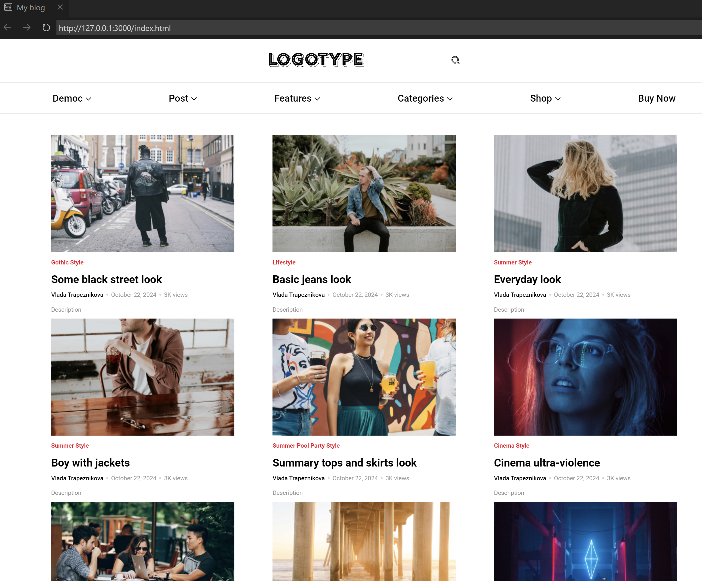

# LOGOTYPE

## To build the site, run the following commands:

```bash
npm install pug
npm install pug-cli -g
pug .\ingex.pug
```

## How to install project 

```bash
git clone https://github.com/vlada-97/blog.git
```

This will generate the site in the same directory as the readme.

## Site preview


## Project Goals
This code was written for educational purposes as part of an online course for web developers at [dvmn.org.](https://dvmn.org/)
